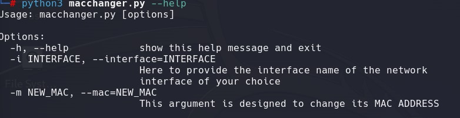

# Mac_Changer
This repo consists of multiple-level MAC changers that are programmed in Python. Developed a versatile MAC address changer using Python on Linux, featuring multi-level customization options for enhanced flexibility. Interactive '--help' Increment Taker: Incorporated an interactive '--help' feature using the 'optparse' library.

This repository is based on the construction or architecture of a MAC address changer, with an increasing complexity of the code and an explanation with the code amended on it.

(generated from chat gpt)
# MAC_ADDRESS:
A MAC (Media Access Control) address is a unique identifier assigned to network interfaces for communications on a physical network. It is a hardware address that is typically assigned by the manufacturer and embedded into the network interface card (NIC) or other hardware device. MAC addresses are used at the data link layer of the OSI network architecture and play a crucial role in facilitating communication between devices on a local network. The address is usually expressed as a 12-digit hexadecimal number, often grouped into pairs separated by colons or dashes (e.g., 00:1A:2B:3C:4D:5E).

In order to attain anonymity, we shall change the mac address in order to protect us from deanonymization.

The tool is designed by keeping in mind that shall not feel and sort of discomfort while redesign or while learning its architecture 

